# Architecture — North Star Support Bot

How the system works end to end: components, the LangGraph conversation state machine, every API call, and the design decisions behind it. All diagrams use Mermaid.

---

## 1. System overview

A two-tier web app: a static React frontend talks over HTTP to a FastAPI backend. The backend runs the conversation through a LangGraph state machine and uses Groq (Llama) to classify the user's intent. All conversation state lives in memory on the backend, keyed by session id.

| Layer | Tech | Where it runs |
|-------|------|---------------|
| Frontend | Vite + React (JS), plain CSS | Vercel (static) |
| Backend | FastAPI, LangGraph | Render |
| LLM | Groq (Llama 3.3 70B), used only for intent classification | Groq cloud |
| State | Python dict keyed by session id | Backend memory (resets on restart) |
| Data | Mock orders, return policy, product catalog in `data.py` | Backend |

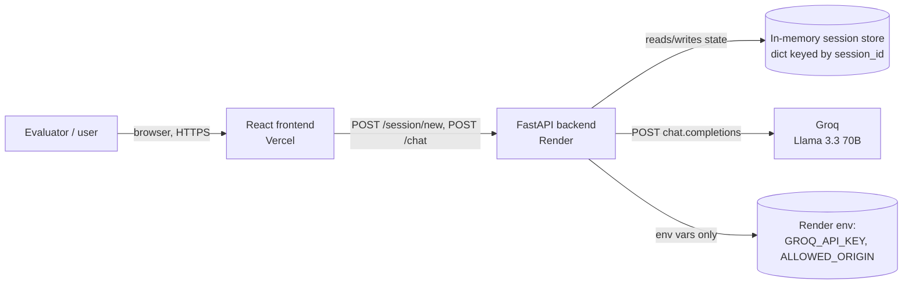

The Groq API key lives **only** in the backend's environment. It is never sent to the frontend; the frontend only ever sees bot replies.

---

## 2. Repository layout

```
backend/
  main.py                FastAPI app: CORS, /session/new, /chat
  graph.py               LangGraph state machine: nodes, conditional edges, compiled graph
  nodes/
    intent_router.py     Groq intent classification (+ "back to menu" reset words)
    order_tracking.py    order lookup flow
    returns.py           return policy flow (one-shot)
    recommendations.py   activity → season → product suggestion flow
    handoff.py           simulated live-agent handoff (one-shot)
  data.py                exact mock data (ORDERS, RETURN_POLICY, RETURNS_LINK, SHIPPING, PRODUCT_CATEGORIES)
  session.py             in-memory session store
frontend/
  src/
    App.jsx              chat shell: header, message log, input bar
    components/          MessageBubble, QuickReplies, OrderForm
    api.js               fetch wrappers for /session/new and /chat
    styles.css           "Rugged Minimalism" design tokens
```

---

## 3. Conversation state

The LangGraph state (a `TypedDict`) is persisted per session between HTTP calls. This is what makes the bot multi-turn despite being stateless over HTTP.

| Field | Purpose |
|-------|---------|
| `session_id` | Key into the session store |
| `messages` | Chat history (sent to Groq as context) |
| `current_flow` | Active flow (`order_tracking`, `recommendations`, …) or `None` |
| `stage` | Step inside the active flow (`ask_order`, `ask_activity`, `ask_season`, `done`) |
| `order_number` | Order number captured in the tracking flow |
| `rec_answers` | Answers collected in the recommendation flow |
| `unrecognized_count` | Consecutive fallback counter (drives handoff escalation) |
| `reply` / `quick_replies` | Output produced by the current graph step |

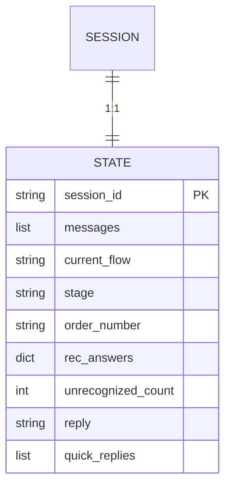

---

## 4. Request lifecycle

Every user message is one `POST /chat`. The backend loads the session state, runs one graph step, persists the mutated state back, and returns the reply. The frontend renders quick replies and inline forms based on the `flow`/`stage` fields returned.

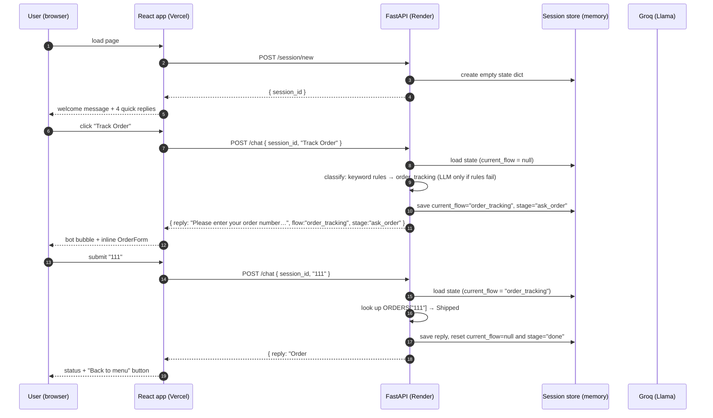

### API contract

| Endpoint | Request body | Response |
|----------|--------------|----------|
| `POST /session/new` | — | `{ session_id }` |
| `POST /chat` | `{ session_id, message }` | `{ reply, quick_replies, flow, stage }` |

`flow`/`stage` are extra fields the frontend uses to decide when to render the order form. The core contract from PLAN.md (`reply`, `quick_replies`, `flow`) is preserved. CORS is locked to `ALLOWED_ORIGIN` (Vercel URL in production, localhost:5173 in dev).

---

## 5. LangGraph state machine

The graph runs **once per HTTP call**. Each call traverses from `START` to `END` along a path chosen by three decider functions, then returns. The persistent `current_flow`/`stage` fields in the session store carry the conversation across calls.

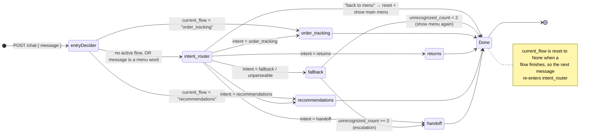

### Edge routing logic (`graph.py`)

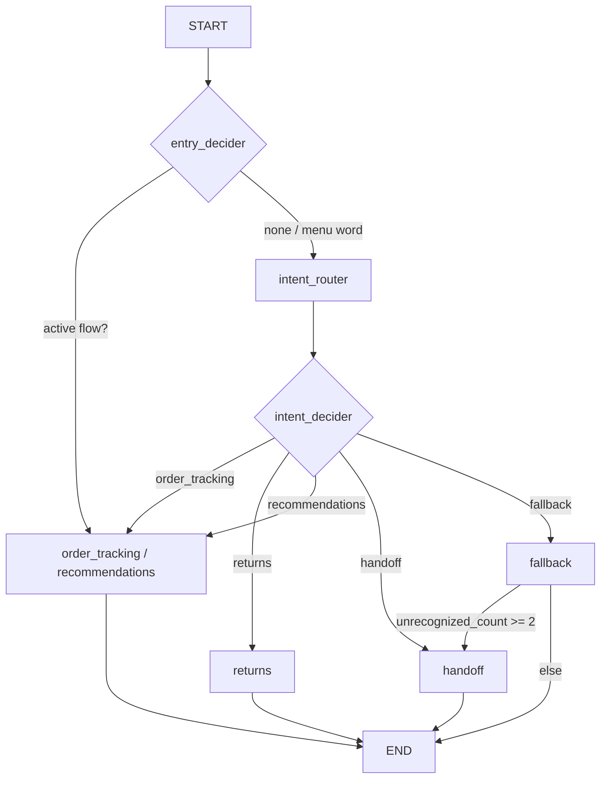

### Node behavior summary

| Node | Entry condition | Behavior | Exit |
|------|-----------------|----------|------|
| `intent_router` | no active flow | keyword rules first (handoff > returns > order > recommendations), greetings caught before rules; Groq only if rules fail **and** a key is set | routes to flow node |
| `order_tracking` | intent OR active flow | shipping-speed questions answered directly; else ask for order number (keyless) or LLM-extract it (key mode) → look up `ORDERS` → status or invalid | stage `done` |
| `returns` | intent | exact policy text + shipping info + returns link | stage `done` (one-shot) |
| `recommendations` | intent OR active flow | ask activity → ask season → map to `PRODUCT_CATEGORIES` | stage `done` |
| `handoff` | intent OR fallback escalation | simulated live-agent message | stage `done` (one-shot) |
| `fallback` | unclassifiable intent | "I didn't understand" + menu; escalates after 2 in a row | stage `done` |

---

## 6. Intent classification (layered)

Intent detection is a two-tier pipeline. **Tier 1** is keyword rules — instant, deterministic, and fully functional with no API key. **Tier 2** is Groq, used only when rules can't decide **and** `GROQ_API_KEY` is set; otherwise the message falls through to the fallback node.

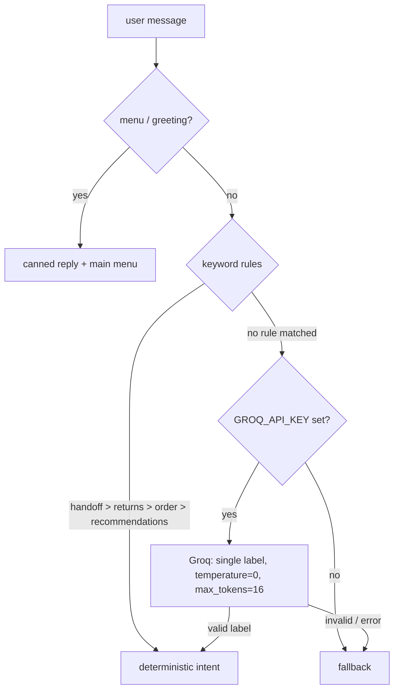

Precedence matters: **handoff > returns > order_tracking > recommendations**. Greetings and menu words are caught before the rules, so "hi" or "thanks" get a friendly reply without spending anything. The LLM prompt carries the 5 valid labels, few-shot examples, and the last 8 messages of history; the response is whitelist-validated and any failure degrades to fallback — so Groq being down or absent never breaks the chat. The LLM exists for the long tail ("is my stuff gonna make it in time?") that keyword rules can't catch.

---

## 7. Flow internals

### 7.1 Order tracking (slot filling — ask, then trust)

Order numbers are **never guessed from unconstrained text**. The bot either asks for the number and trusts the prompted reply (keyless mode), or lets the LLM extract it when a key is present. A digit run followed by a quantity/duration word ("100 days") is rejected, so the bot never "finds" an order number that is really a date or amount.

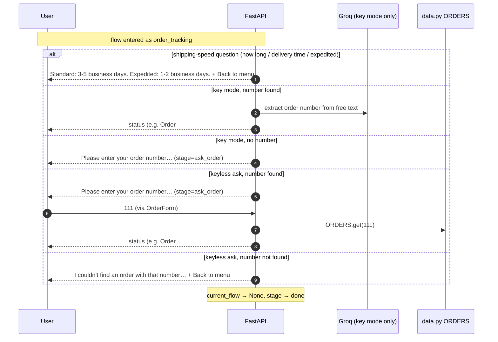

### 7.2 Product recommendations

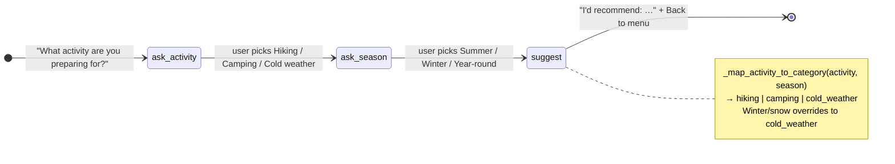

### 7.3 Fallback → handoff escalation

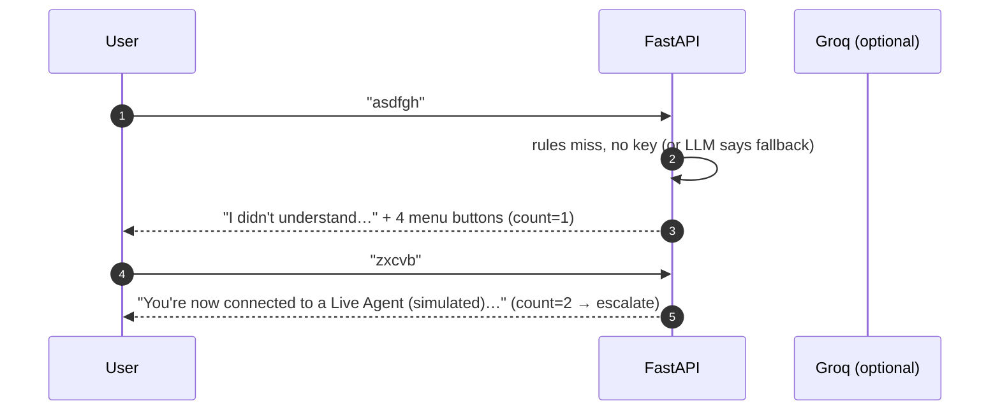

---

## 8. Frontend behavior

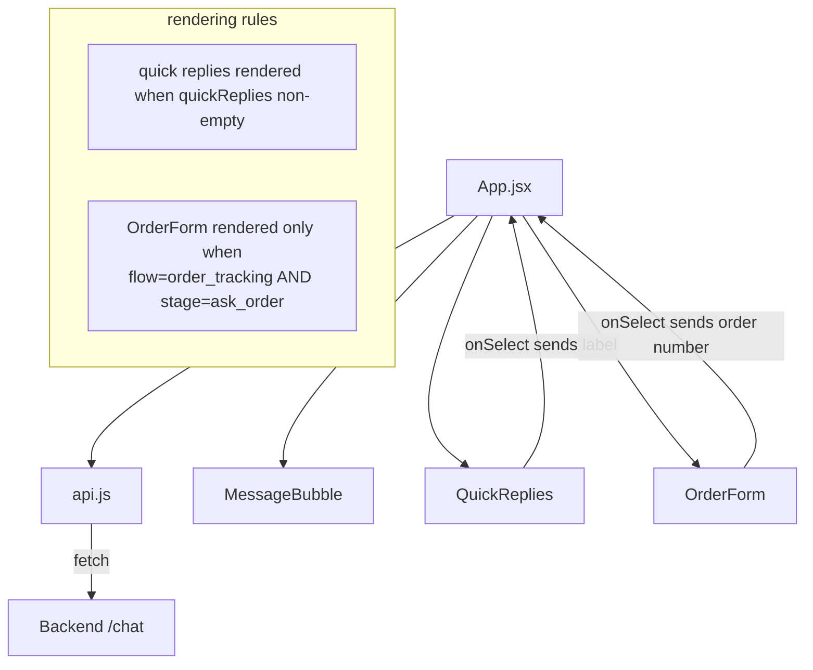

- On mount, `App.jsx` calls `/session/new` and holds the id in React state (never localStorage).
- Bot bubbles (Deep Forest `#1b3022`) left, user bubbles (light `#dce9ff`) right, Safety Orange `#fe932c` accent buttons — per `design/DESIGN.md`.
- Persistent **Talk to Human** button in the header sends the text `"Talk to human"`, which the intent router maps to `handoff` at any point in the conversation.
- After a flow resolves, the returned `quick_replies: ["Back to menu"]` render a button that resets to the main menu.

---

## 9. Deployment

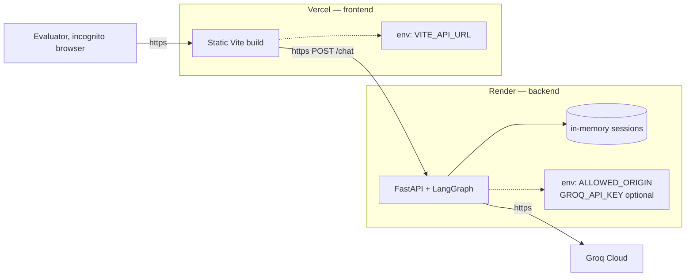

Build/start commands: backend `pip install -r requirements.txt` then `uvicorn main:app --host 0.0.0.0 --port $PORT`; frontend standard Vite build. Two-instance memory means sessions never survive restarts — acceptable per PLAN.md.

---

## 10. Determinism & LLM usage (design discussion)

### 10.1 What is deterministic today

The **flow logic is fully deterministic.** Given the same state and message, the graph always:

- routes to the same node (`entry_decider`, `intent_decider` are pure rules),
- returns the same policy text, order statuses, and product lists (all from `data.py`, exact strings),
- produces the same quick replies,
- resets state identically after `done`.

The **keyless mode is fully deterministic end to end**: intent detection is pure keyword rules, and order numbers are only read from the prompted reply. Nothing random and no external dependency. When a key is set, only the LLM tier (ambiguous classification and order-number extraction) is non-deterministic; `temperature=0`, whitelist validation, and graceful fallback keep it stable and safe.

### 10.2 Rejected: LLM-only intent detection

A pure LLM gate makes the entire demo depend on one live external API and one model call per message:

- **Latency/failure:** every message waits on Groq; a timeout or quota error blocks everything.
- **No offline mode:** without `GROQ_API_KEY` the bot cannot even recognize "Returns" or "Talk to human".
- **Determinism:** identical phrasings can occasionally get a different flow.
- **Cost:** every message, even "Returns" or "111", spends a token.

### 10.3 Implemented: layered intent detection (heuristic first, LLM fallback)

The classifier keeps common cases instant and deterministic and uses the LLM only for ambiguity:

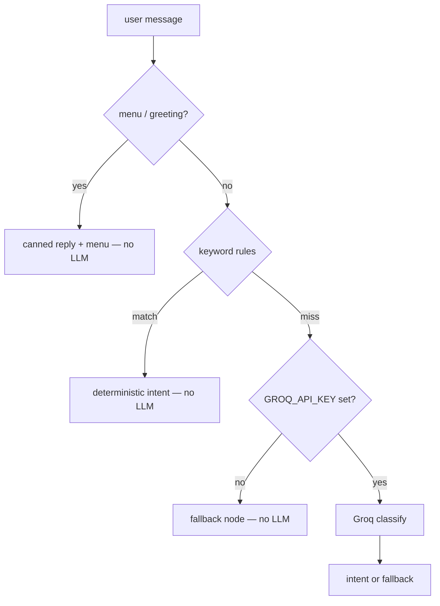

Rules are checked in precedence order (`handoff > returns > order_tracking > recommendations`). Order numbers are handled by **slot filling**: keyless mode asks for the number and trusts the prompted reply (with a quantity-word guard so "100 days" is never read as an order id); key mode asks the LLM to extract it from free text. Shipping-speed questions are answered directly with the exact shipping info.

This gives: **offline degradability** (the graded path works with zero keys), **determinism for the demo-critical flows**, **cost reduction** (LLM fires only on ambiguity), and **full natural-language coverage** when a key is present.

### 10.4 Where NOT to use the LLM

Reply generation stays rule-based. The mock data is exact and the contract forbids inventing order numbers or changing policy text. If the LLM generated replies it could hallucinate a fake status or paraphrase the policy. The right split:

| Concern | Best handled by |
|---------|-----------------|
| Which flow / what the user wants | Rules first, LLM fallback (implemented) |
| Order number in free text | Ask for it keyless; LLM extraction key-mode |
| Order status, policy text, product lists | Exact mock data (never the LLM) |
| Tone/polish of *final* canned reply | Optional LLM rephrasing after lookup succeeds, as a cosmetic layer |

### 10.5 Cost analysis

| Mode | LLM calls | Typical session cost |
|------|-----------|----------------------|
| No key | 0 | $0 (fully functional, guided) |
| Key, clear phrasing | 0 (rules win) | $0 |
| Key, order message with a number | 1 (extraction) | < $0.001 |
| Key, ambiguous non-order message | 1 (classification) | < $0.001 |

Uses a small model (`llama-3.1-8b-instant`), `temperature=0`, and `max_tokens=16` (classification) / `8` (extraction) so even paid sessions stay in the sub-cent range.

### 10.6 Summary

- The bot is **fully deterministic keyless** and **deterministic everywhere except the LLM tier** when a key is set.
- **Heuristic-first with LLM fallback is the production pattern:** same natural-language coverage as LLM-only, plus determinism, offline resilience, lower latency, and near-zero cost.
- Deterministic **outputs** (exact statuses/policy/products) + flexible **inputs** (rules → LLM only for ambiguity) is the correct model for a support bot: consistent, correct answers that never hallucinate data, while still understanding whatever the user types.

Current implementation = **§10.3 (hybrid, implemented)**. The heuristic tier fully covers the graded path keyless; the LLM tier adds natural-language flexibility and order-number extraction when a key is set.
