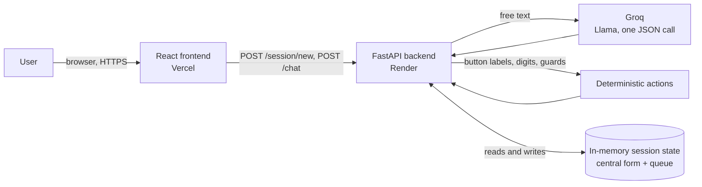
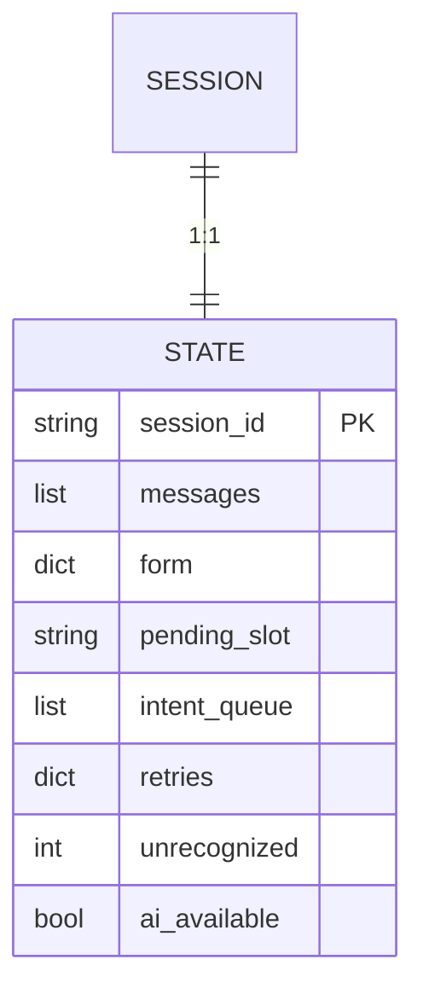
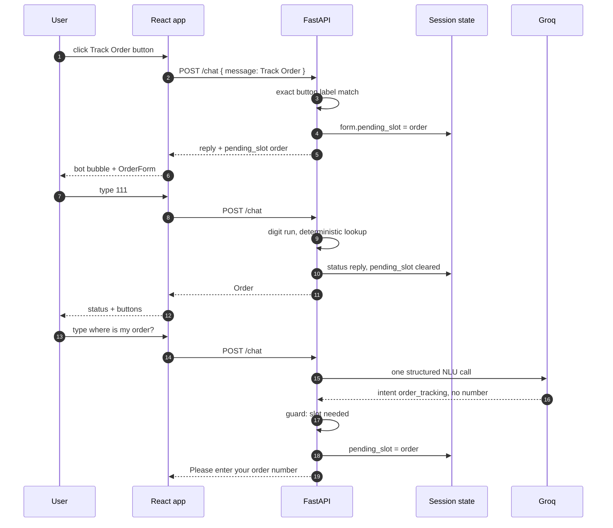
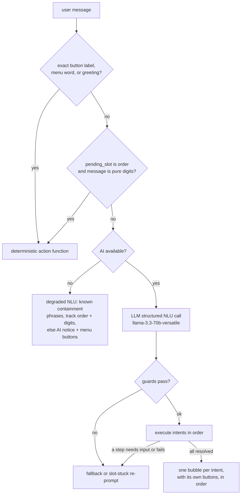
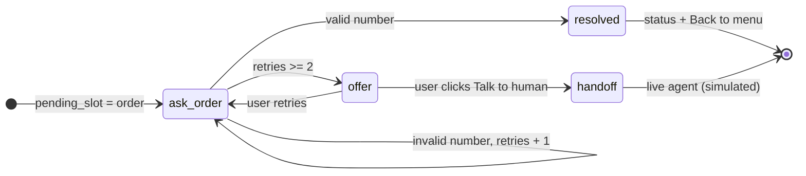
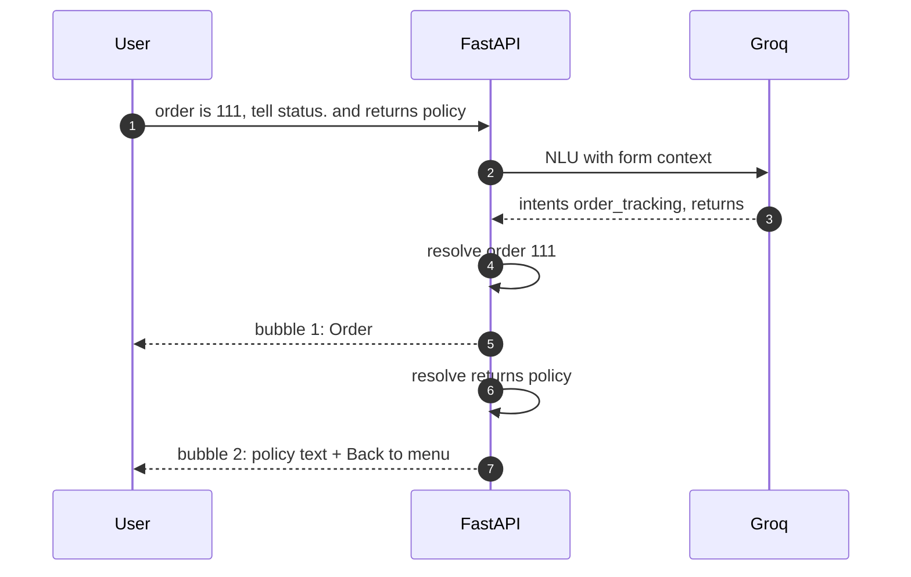
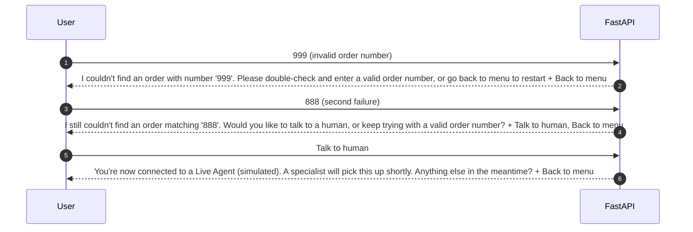
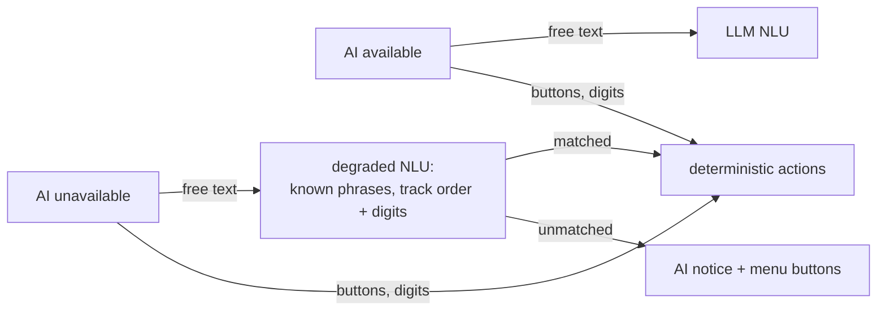
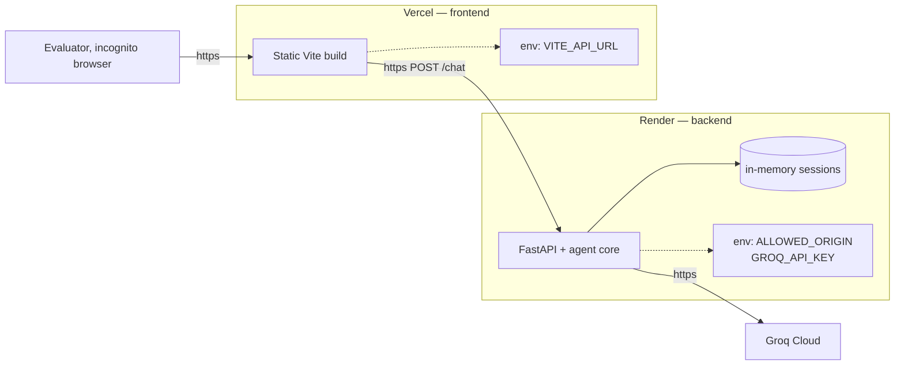

# Architecture — North Star Support Bot

How the system works end to end: components, the agentic core, the central conversation state, every API call, and the design decisions behind it. All diagrams use Mermaid.

---

## 1. System overview

A two-tier web app: a static React frontend talks over HTTP to a FastAPI backend. Every free-text message is handled by a single **agent core** that calls Groq (Llama) to classify intent and extract entities in one structured call. Quick-reply **buttons are deterministic** and always available alongside the AI, so users can navigate by clicking even when the AI is unreachable. All conversation state lives in memory on the backend, keyed by session id.

| Layer | Tech | Where it runs |
|-------|------|---------------|
| Frontend | Vite + React (JS), plain CSS | Vercel (static) |
| Backend | FastAPI, agent core + deterministic actions | Render |
| LLM | Groq (Llama), one structured JSON call per free-text message | Groq cloud |
| State | Python dict keyed by session id (central form) | Backend memory (resets on restart) |
| Data | Mock orders, return policy, product catalog in `data.py` | Backend |



The Groq API key lives **only** in the backend's environment. It is never sent to the frontend; the frontend only ever sees bot replies and button labels.

---

## 2. Repository layout

```
backend/
  main.py                FastAPI app: CORS, /session/new, /chat, ai_available flag
  agent.py               LLM agent: prompt with form + queue + history, JSON call, guards
  actions.py             deterministic flow functions (buttons, slot filling, canned replies)
  session.py             in-memory session store (central state)
  data.py                exact mock data (ORDERS, RETURN_POLICY, SHIPPING, PRODUCT_CATEGORIES)
  requirements.txt
frontend/
  src/
    App.jsx              chat shell: header, message log, input bar, AI-availability handling
    components/          MessageBubble, QuickReplies, OrderForm (digits-only)
    api.js               fetch wrappers for /session/new and /chat
    styles.css           "Rugged Minimalism" design tokens
```

---

## 3. Conversation state

The state is a single Python dict persisted per session. It is the **central form** that is injected into the LLM prompt every turn, so the AI always knows the current context (order number collected, activity chosen, unanswered questions, pending compound-intent queue).

| Field | Purpose |
|-------|---------|
| `session_id` | Key into the session store |
| `messages` | Chat history (sent to Groq as context) |
| `form` | Collected data: `order_number`, `activity`, `season` |
| `pending_slot` | Slot currently being filled (`order` / `activity` / `season`) or `None` |
| `intent_queue` | Ordered flow actions awaiting execution from a compound message |
| `retries` | Failure counter per slot (`order_number`, `activity`, `season`) — drives the handoff offer |
| `unrecognized` | Consecutive fallback counter — at 2 the fallback reply adds a handoff offer |
| `ai_available` | Whether the LLM responded successfully in this session |



---

## 4. Request lifecycle

Every user message is one `POST /chat`. Two input paths mutate the **same state**:

1. **Button path (deterministic, always works):** the message exactly matches a button label, menu word, greeting, or a pure digit run. A fixed action function runs — no LLM call, nothing can go wrong.
2. **Agent path (free text):** the LLM classifies intent and extracts entities in one structured JSON call, backend guards validate the result, then deterministic action functions execute the intents in order.



### API contract

| Endpoint | Request body | Response |
|----------|--------------|----------|
| `POST /session/new` | — | `{ session_id, ai_available }` |
| `POST /chat` | `{ session_id, message }` | `{ reply, quick_replies, replies, pending_slot, ai_available }` |

`replies` is an array of `{ reply, quick_replies }` — one entry per resolved intent, rendered as separate bot bubbles in order. The top-level `reply`/`quick_replies` mirror the first bubble. `pending_slot` tells the frontend when to render the OrderForm (`pending_slot == "order"`); quick replies render whenever `quick_replies` is non-empty. CORS is locked to `ALLOWED_ORIGIN`.

---

## 5. Decision pipeline

Each message flows through UI-level determinism first (exact button labels, menu words, greetings, pure-digit slot fills), then the LLM, then deterministic guards and actions. **All other free text goes to the LLM at any length** — there is no word-count gate, no phrase containment, and no digit-based routing in the live path. Heuristics exist only as a degraded NLU when the AI is unreachable.



---

## 6. Agent core (`agent.py`)

One Groq call per free-text message, `response_format=json_object`, `temperature=0`, model `llama-3.3-70b-versatile` (override with `GROQ_MODEL`). The prompt carries the valid intent labels, entity enums, the **central form**, the **pending slot**, the **intent queue**, and the last messages of history. The model owns **all** natural-language understanding — intent selection *and* entity extraction. The backend adds no forced intents and no keyword guessing on top of it; it only validates and executes.

```json
{
  "intents": ["order_tracking", "returns"],
  "form_updates": { "order_number": "111", "activity": null, "season": null }
}
```

- **Intents (whitelist):** `order_tracking`, `shipping_info`, `returns`, `recommendations`, `handoff`, `fallback`.
- **Enums:** `activity` is one of `hiking | camping | cold_weather`; `season` is one of `summer | winter | year-round`. The model may only emit these values.
- **Extraction rule:** the prompt instructs the model to always put the order number into `form_updates.order_number` whenever the user mentions one anywhere in the message — even in compound requests — and to include only intents the user explicitly asked about.
- **Few-shot examples** cover the known failure cases and compound forms: `where is my abc → fallback`, `provide shipping information → shipping_info`, `order is 111 tell status and the return policy → [order_tracking, returns]`, `about order 222 and shipping details → [order_tracking, shipping_info]`, `track order 333 → [order_tracking]`.
- The response is JSON-parsed and whitelist-validated; any parse failure degrades to the AI-down notice.

---

## 7. Guards (deterministic spine)

Run after every LLM call. The LLM proposes; the backend disposes.

| Rule | Behavior |
|------|----------|
| Intent whitelist | Unknown labels dropped; empty list → fallback |
| `order_tracking` without a number and without a track noun | Reclassified as `fallback` (kills `where is my <abc>?`) |
| Pending slot answered with unusable input (slot-stuck) | Deterministic re-prompt with the slot's options; order-slot misses count in `retries` and offer handoff at 2 |
| Intent needs input or fails validation (e.g. order not in `ORDERS`) | `needs_input` → re-prompt, **clear the intent queue** — later intents never run |
| Retry counters | `retries[slot]` / `unrecognized`; at 2 failures the reply appends a handoff offer (never automatic) |
| Reply text | Always built by deterministic actions from `data.py` — the LLM never writes final replies |

---

## 8. Flow actions (`actions.py`)

Every action is a pure function over the central state: mutates `form` / `pending_slot` / `retries` / `intent_queue` and returns `(reply, buttons)`; the agent adds a `needs_input` flag per intent. The same functions serve both the button path and the agent path, so clicking and typing produce identical state transitions.

| Action | Behavior |
|--------|----------|
| `track_order` | Sets `pending_slot = order`, asks for the number |
| `resolve_order` | Looks up `ORDERS` → status, or re-prompts on invalid (retry counter) |
| `shipping_info` | One-shot: standard + expedited shipping text from `data.py` |
| `returns` | One-shot: policy text + returns link |
| `recommendations` | Slot-fills `activity` then `season`, then maps to `PRODUCT_CATEGORIES` |
| `handoff` | One-shot: simulated live-agent message |
| `back_to_menu` | Clears `form`, `intent_queue`, `retries`, `pending_slot` → main menu |

### Slot filling

`pending_slot` is the single "what are we waiting for" pointer. On invalid input the bot stays in the slot, re-prompts, and bumps `retries[slot]`. After **2 failures** the reply adds a handoff offer while still asking — the user can retry or click.



---

## 9. Compound intents

A message like `order is 111, tell status. and tell me about return policy` yields `intents: [order_tracking, returns]`. Intents are executed **one at a time, in order**, until completion. Each resolved intent emits its **own bot bubble** with its own buttons (each action is a separate function call; nothing is concatenated):

- `order_tracking` resolves 111 → status bubble; then `returns` runs → policy bubble. Two separate bubbles, in order.
- If any intent **needs input or fails validation** (e.g. order number `412` is not in `ORDERS`), the remaining queue is **cleared and execution stops there** — later intents never run, so the customer stays focused on the current issue. The failing intent's bubble carries the re-prompt.



---

## 10. Handoff — never automatic

There is no silent escalation anywhere. On repeated failures the bot escalates the offer while still asking, never forcing:

- **Invalid slot answers (2×)** — the reply appends `[Talk to human, Back to menu]` buttons.
- **Unrecognized messages (2×)** — the reply text offers a human handoff; the button row stays the clean 4-button menu (the menu already includes Talk to Human — no duplicate buttons).



---

## 11. AI availability and degradation

`ai_available` is set **lazily from real outcomes** — no probing calls:

- No `GROQ_API_KEY` → `False` from session start.
- A Groq timeout/error during a call → `False` for the rest of the session.

While `False`, the backend still answers every message: deterministic buttons and digits work fully, a **degraded NLU** catches known containment phrases (`how long does shipping take`, `track order 333`, …), and everything else gets the notice *"Sorry, I can't reach the AI right now. Please use the buttons to navigate, or try typing again in a moment."*



---

## 12. Frontend behavior

- On mount, `App.jsx` calls `/session/new`, holds the id in React state, and stores `ai_available`.
- Quick-reply buttons render whenever `quick_replies` is non-empty — they are the deterministic navigation layer and are shown **alongside** the AI, never hidden.
- Each entry of the `replies` array renders as its **own bot bubble** with its own buttons, in order.
- OrderForm renders only when `pending_slot == "order"` (attached to the last bubble) and validates digits-only client-side.
- The text input is **never disabled**: if the AI is unreachable, typing returns the AI-unavailable notice while buttons keep the flows working.
- Persistent **Talk to Human** header button works in both modes (deterministic label).

---

## 13. Deployment



Build/start commands: backend `pip install -r requirements.txt` then `uvicorn main:app --host 0.0.0.0 --port $PORT`; frontend standard Vite build. Sessions never survive restarts — acceptable per PLAN.md.

---

## 14. Design rationale

**LLM-first, deterministic spine.** The goal is a support bot with Dialogflow/Botpress-class accuracy: intent classification *and* entity extraction in one NLU call, form-style slot filling with validation and re-prompts, context-aware state, fallback intents, and human-handoff offers. A pure keyword matcher can always be defeated by novel phrasing, so the LLM owns natural-language understanding.

**Buttons are deterministic by construction.** Button labels and digit form inputs are a closed set, so their handlers never need a model — and they are always rendered, giving users free will to click or type, and giving the bot a guaranteed-working path when the AI is unreachable.

**The LLM proposes, the backend disposes.** All replies are built by deterministic actions from exact mock data; the LLM only ever decides *what the user wants* (intent + entities). This prevents hallucinated order statuses or paraphrased policy text while keeping full natural-language flexibility.

**Graceful degradation beats hard failure.** LLM down → buttons still work, known phrases are still answered by the degraded NLU, and everything else gets a clear notice. Nothing crashes, no dead ends, no automatic handoffs.

**Trust the model — don't fight it.** Intent classification and entity extraction are the LLM's job, and it does them with the full message in context. No phrase-containment, digit-gating, or forced-intent heuristics sit in front of it; they were removed after they caused truncation bugs (`about order 222 and shipping details` must never become shipping-only). Backend heuristics exist only where they cannot be wrong: exact button labels, pure-digit slot fills, and the degraded NLU for the AI-down case.
